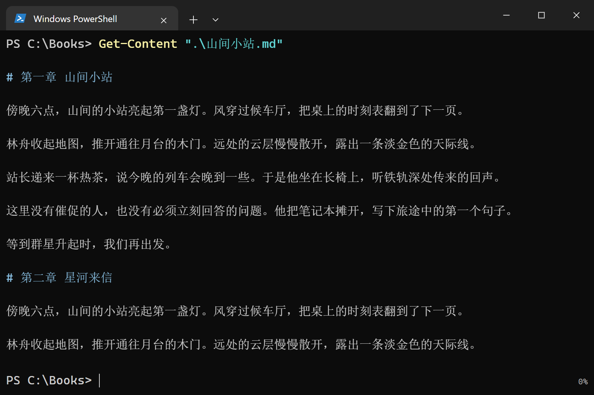
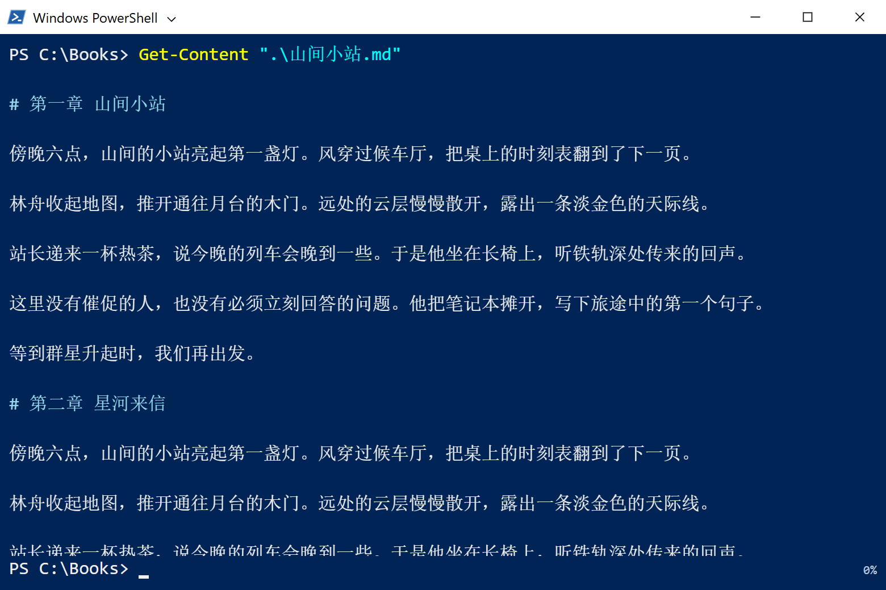
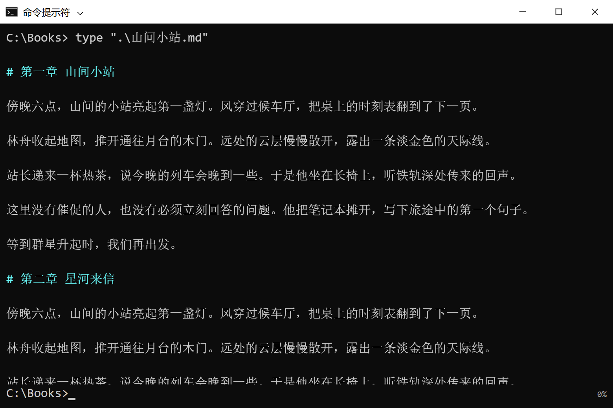
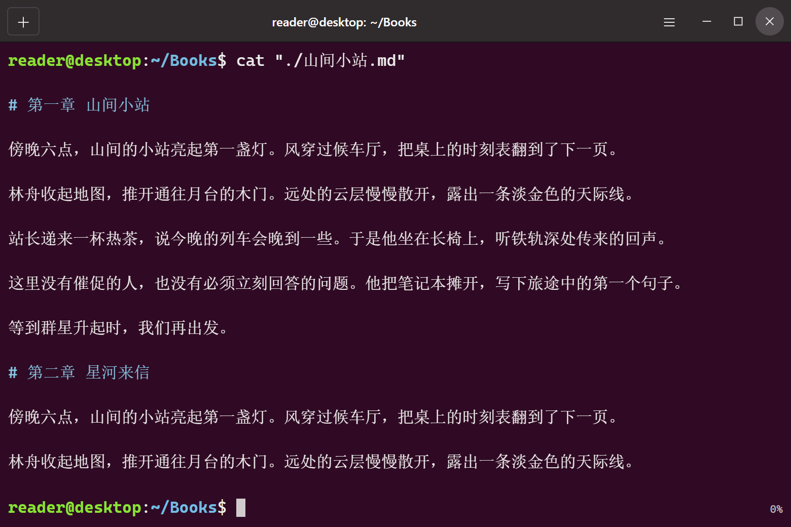
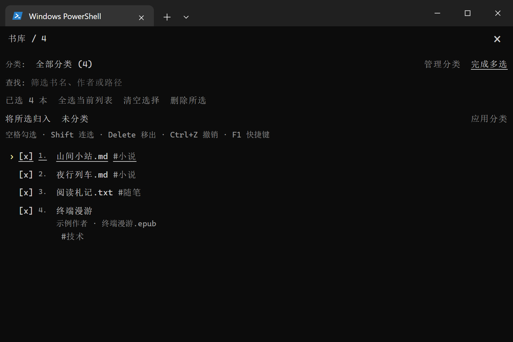
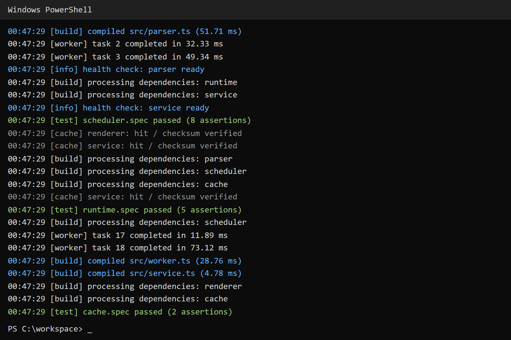
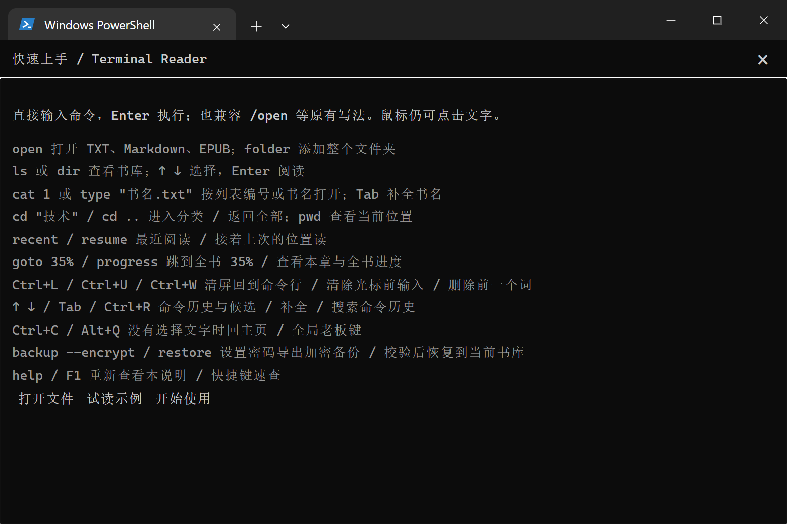

# Terminal Reader · 终端阅读器

在熟悉的命令行外观里，安静地读一本书。

Terminal Reader 是支持 **TXT、Markdown、EPUB** 的桌面阅读器，提供 PowerShell、经典 Windows PowerShell、CMD 和 Linux 终端外观。界面以纯文本操作为主，全程支持键盘，也保留鼠标。

[下载最新版](https://github.com/mangfufu/terminal-reader/releases/latest) · [快速上手](#快速上手) · [完整键盘操作](KEYBOARD.md) · [0.6.0 更新说明](RELEASE-0.6.0.md)



> 本页所有截图均在独立的临时环境中生成。书名、正文、作者、分类和记录均为虚构示例；不使用个人书库、私密书库、真实文件路径或个人配置。截图中的 Books 等路径是界面预设。

## 界面

| 经典 Windows PowerShell | CMD |
| --- | --- |
|  |  |



四套外观可以在应用内切换，Windows 也能使用 Linux 外观。字号、字体、行距、字重和配色均可调整，窗口最小可缩至 280 × 160。

## 功能

| 阅读 | 书库与操作 |
| --- | --- |
| TXT、Markdown、EPUB 2/3 正文与目录 | 自定义分类、筛选、多选、批量移出与撤销 |
| 章节导航、全文搜索、书签和跳转返回 | 应用内终端文件选择，不弹资源管理器 |
| 自动滚动与速度预览 | 文件夹导入、源文件刷新、系统文件关联 |
| 字符位置记忆，最近阅读与继续阅读 | 完整键盘操作，鼠标同样可用 |
| 进度条、页数、百分比三种进度样式 | 命令补全、历史搜索和终端命令别名 |
| 全书/章节进度、剩余页数估算、百分比跳转 | 当前书库备份、校验预览与合并恢复 |
| 长文虚拟渲染 | 密码保护的独立书库与加密备份 |

### 书库、分类与多选



用 ↑/↓ 选择，Enter 阅读；Ctrl+A 全选，Delete 批量移出，Ctrl+Z 撤销。移出操作仅删除应用缓存，**保留磁盘原文件**。←/→ 切换书籍：读过的恢复位置，未读的从首行开始。

### 模拟终端与老板键



可以切换纯阅读与模拟命令行模式，调整正文颜色强度及模拟任务频率。构建、测试、安装等输出只是视觉效果，不会实际执行命令。

默认老板键 **Alt+Q**，可在 `style` 中改键；支持全局触发和可选的失焦自动伪装。在其他窗口按老板键只会遮挡阅读器，返回阅读器后可解除。全局快捷键已在 Windows 和 Ubuntu X11 验证；其他桌面环境的支持情况取决于系统。

### 密码保护的独立书库

与普通书库分开，普通列表、分类、命令候选和应用内帮助不显示它的入口或条目。首次进入设置密码，后续每次进入都要验证；离开窗口、回主页或触发老板键后锁定。

内容和阅读记录使用 AES-256-GCM 加密，密码通过 PBKDF2-SHA256 派生密钥；独立书库备份始终加密。原始电子书文件保持原样。入口、旧版迁移及恢复方式见 [独立书库说明](PRIVATE-LIBRARY.md)。

发布包不附带任何预先建立的私密书库、密码、个人数据或备份。运行后由使用者自行建立书库。

## 下载与安装

前往 [GitHub Releases](https://github.com/mangfufu/terminal-reader/releases/latest)：

| 平台 | 文件 | 使用方式 |
| --- | --- | --- |
| Windows x64 | `TerminalReader-0.6.0-win-x64-setup.exe` | 当前用户安装包 |
| Windows x64 | `TerminalReader-0.6.0-win-x64.exe` | 直接运行 |
| Ubuntu / Debian x64 | `TerminalReader-0.6.0-linux-x64.deb` | 安装并处理依赖 |
| Linux x64 | `TerminalReader-0.6.0-linux-x64.AppImage` | 添加执行权限后运行 |

Windows 需要 Microsoft WebView2 Runtime，安装程序可在缺失时安装。Linux 使用 GTK 3 / WebKitGTK 4.1，基于 Ubuntu 24.04 构建；裸可执行文件需要系统具备对应动态库。

```bash
sudo apt install ./TerminalReader-0.6.0-linux-x64.deb
# 或使用 AppImage
chmod +x TerminalReader-0.6.0-linux-x64.AppImage
./TerminalReader-0.6.0-linux-x64.AppImage
```

Release 附带 `SHA256SUMS.txt`。GitHub 提供同一版本的源码压缩包，发布构建使用仅含公开源码的隔离目录，并移除本机编译路径。

## 快速上手



在底部命令行输入命令并按 Enter；命令无需斜杠，原来的 `/open` 等写法仍兼容。

```text
open                  选择电子书
folder                导入文件夹
ls                    查看书库（也可用 dir）
cat 1                 打开列表第 1 本书
cat "山间小站.md"     按书名打开，这里是虚构示例
cd "小说"            进入分类
cd ..                 返回全部分类
recent                最近阅读
resume                继续上次阅读
goto 35%              跳到全文 35%
progress              查看全书和章节进度
backup                备份当前书库
backup --encrypt      为普通书库备份设置密码
help                  快速上手
```

| 快捷键 | 操作 |
| --- | --- |
| Ctrl+K / `/` | 输入命令 |
| Tab、↑/↓、Ctrl+R | 补全、命令历史、搜索历史 |
| Ctrl+O / Ctrl+Shift+O | 导入文件 / 文件夹 |
| Ctrl+B / Ctrl+F / Ctrl+J | 书库 / 搜索 / 章节 |
| Ctrl+D | 书签 |
| Ctrl+C | 未选择文字时关闭当前书并回主页 |
| 空格 | 开始或暂停自动滚动 |
| Alt+Q | 老板键，可自定义 |
| F1 / F6 / Esc | 快捷键速查 / 切换区域 / 返回 |

完整操作见 [KEYBOARD.md](KEYBOARD.md)。这些命令只控制阅读器，不是系统 Shell。

## 本地开发

需要 Node.js 24、Rust stable，以及 Tauri 对应平台的原生构建依赖。

```bash
npm ci
npm run desktop
```

仅预览前端使用 `npm run dev`；真实文件导入和系统全局快捷键使用桌面程序。

```bash
npm test
npm run build
cargo test --locked --manifest-path src-tauri/Cargo.toml
npm run desktop:package  # Windows EXE / NSIS
npm run desktop:linux    # Linux deb / AppImage
```

Windows 的 Rust 测试需要 Windows SDK 资源编译器；可在 Visual Studio 开发者终端运行。Linux 原生依赖见 [ci/build-linux.yml](ci/build-linux.yml)。`ci/` 提供两平台 GitHub Actions 模板，包含测试和打包步骤；需要时可复制到 `.github/workflows/` 启用。

交互测试位于 `scripts/verify-*.mjs`。文档截图可运行 `node scripts/screenshot-public-demo.mjs` 重建：先启动端口 17420 的 Vite，或用 `DEMO_URL` 指定开发预览地址，使用 `CHROME_BIN` 指定 Chrome。该脚本仅生成虚构示例，不连接桌面应用或读取个人配置。

## 支持边界

- EPUB 提取正文与章节；图片、复杂排版、音视频、DRM、PDF、MOBI、AZW 和 OCR 不在当前支持范围。
- Markdown 支持基础标题、段落、引用和代码块。
- 页数根据当前窗口估算，字号和窗口大小变化后会重新计算。
- 本地读取无需 API key，不提供云同步或账户服务。
- 0.6.0 会升级本地缓存结构；升级后请继续使用新版读取书库。
